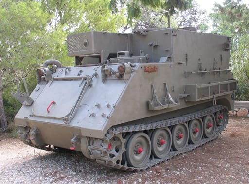
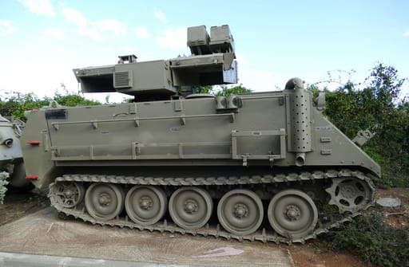
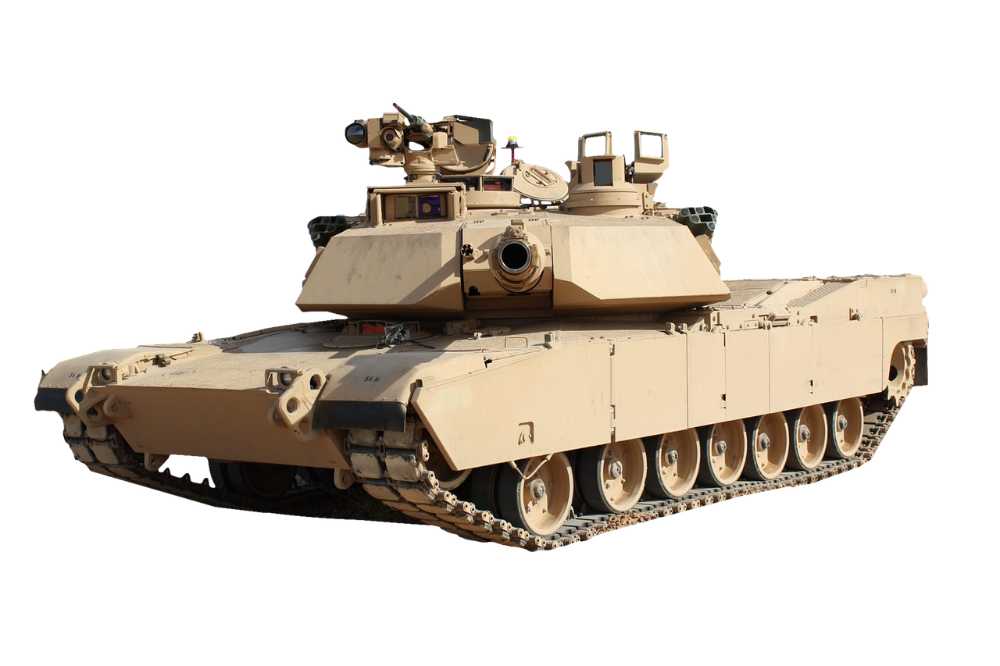

# The Unkillable M113

## The Armored Personnel Carrier That Refused to Die

## The Birth of the "Tin Can"

The year was 1960. The location: San Jose, California. Inside a sprawling factory complex owned by the Food Machinery Corporation (FMC), a tracked vehicle was quietly rolling off the production line and into the California sun. To the untrained eye, it looked cheap, unremarkable, and completely expendable. It weighed just under 13 tons, but its hull was not forged from heavy steel. Instead, it was constructed from aluminum.

Its armor, even at its thickest point, measured barely 38 mm. Its armament consisted of a single heavy machine gun bolted to an open mount on the roof, forcing the operator to stand exposed from the chest up. Its profile was a featureless box resting on tracks. When senior military officers inspected the first production models, they questioned whether an aluminum vehicle could survive a modern battlefield. Skeptics called it a "tin can" and a "glorified battle taxi."

Yet this unimpressive aluminum box, officially designated the M113 Armored Personnel Carrier, would fight in more wars, on more continents, under more flags, and across more decades than almost any other Western armored vehicle. More than 80,000 units would be built, making it one of the most mass-produced armored vehicles of the postwar era.

## The Strategic Problem of the 1950s

To understand why the M113 existed, one must understand the logistical and tactical problems facing the United States Army in the mid-1950s. The Korean War exposed a gap in American mechanized capability. The Army needed one vehicle that could carry a full infantry squad under armor protection, keep pace with tanks across rough terrain, cross rivers without specialized bridging equipment, and remain light enough to fit inside a transport aircraft.

None of the existing vehicles could achieve all four tasks. The M75 was fully enclosed but weighed nearly 19 tons, cost around $100,000 per unit, and was too heavy to airlift or swim. Its production stopped after 1,729 vehicles. The successor M59 was cheaper but underpowered and unreliable.

In June 1954, the Detroit Arsenal began studying a family of lightweight tracked vehicles sharing a common chassis. By January 1956, formal development was approved. FMC received the contract for evaluation vehicles. Half the prototypes were steel T117s, while the others used aluminum and were designated T113s.

## The Aluminum Gamble and Engineering Marvel

The choice of aluminum was a radical departure from military tradition. FMC partnered with Kaiser Aluminum and Chemical Company to develop a specialized 5083 aircraft-grade alloy. Aluminum armor had to be roughly three times as thick as steel to stop the same projectile, but the thicker hull was highly rigid and did not need heavy internal reinforcing structures.

The final result weighed significantly less than the steel alternative while providing useful protection against small arms fire and artillery shell splinters.

## The Mechanics of the Machine

The M113 used a welded 5083 aluminum hull, tapering from 38 mm at the front to as little as 12 mm on the sides. Power came from the Detroit Diesel 6V53, a reliable two-stroke V6 producing approximately 215 horsepower, paired with an Allison TX100 automatic transmission. This gave it a top road speed of roughly 42 mph and a swimming speed of about 3.6 mph.

Propelled by its tracks, the vehicle needed little preparation for amphibious movement beyond raising a small trim vane at the front. Its range on a full tank exceeded 300 miles. Its low weight meant a C-130 Hercules could carry it, its diesel engine reduced the fire risk of gasoline-powered predecessors, and its hydraulic rear ramp let a squad of 11 infantrymen dismount quickly. Early production cost was roughly $22,000 per vehicle, allowing the government to purchase them in large numbers.

## Baptism by Fire: The Jungles of Southeast Asia

The M113 entered production in June 1960. By 1962 it had reached South Vietnam, where it became an unforgiving combat laboratory. On March 30, 1962, 32 M113s arrived and were issued to two mechanized rifle companies of the Army of the Republic of Vietnam.

The vehicles initially proved devastating against lightly armed Viet Cong guerrillas. They could swim across deep canals and crash through thick tree lines, making them a powerful psychological weapon in the flooded paddies of the Mekong Delta. The Viet Cong referred to the vehicle as the "Green Dragon."

## The Battle of Ap Bac and the Critical Flaw

The sense of invincibility was shattered at Ap Bac on January 2, 1963. South Vietnamese troops supported by American advisors engaged an entrenched Viet Cong force. The Viet Cong had studied the M113 and identified its critical vulnerability: the commander's heavy machine gun position left the operator exposed from the chest up. At least 14 South Vietnamese M113 gunners were killed during the battle.

The battle exposed a design and doctrine problem. The M113 was intended as a battle taxi, with soldiers expected to dismount before fighting. Counterinsurgency warfare demanded that crews fight while mounted, and the open machine-gun position became a death trap.

## The ACAV Transformation

The immediate solution was a gun shield for the APC's .50-caliber machine gun. The deaths at Ap Bac encouraged the 2nd Armored Cavalry to fabricate shields from soft steel plating scavenged from a sunken ship.

By 1965, the United States Army standardized the field modification as the Armored Cavalry Assault Vehicle, or ACAV, kit. It included a shielded .50-caliber turret, two shielded M60 machine guns at the rear cargo hatch, and thicker belly armor against mines. The same aluminum box had transformed from a simple troop transport into an aggressive fighting vehicle through field adaptation.

## Global Combat: From the Sinai to Ukraine

The M113 fought far beyond Vietnam. Israel received M113A1s in 1970 and fielded 448 during the Yom Kippur War in 1973. Israeli forces found that RPG shaped charges could penetrate the aluminum hull, leading to the up-armored Zelda variant and eventually the heavily protected Namer carrier.

During the 2003 Iraq War, Sergeant First Class Paul Ray Smith earned the first Medal of Honor of the conflict for actions at Baghdad International Airport. He manned the .50-caliber machine gun of a damaged M113, firing over 300 rounds and holding off enemy forces. His final stand saved approximately 100 American soldiers.

Beginning in 2022, partner nations donated more than 1,700 M113s to Ukraine. Fitted with bolt-on cage armor and modern remote weapon stations, the decades-old vehicle returned to a peer battlefield. The vehicle meant to have been retired was once again carrying soldiers into combat.

## A Platform for Every Purpose

Soviet vehicles such as the BMP-1 looked superior on paper. The BMP-1 carried a 73 mm cannon, an anti-tank guided missile, and firing ports for its infantry. The M113 carried a single machine gun and expected passengers to dismount before the serious shooting began.

But the BMP-1 was a specialist vehicle, while the M113 was a universal platform. The same basic aluminum hull became more than 40 official variants, including the M106 mortar carrier, M163 Vulcan air defense system, M577 command post, M901 improved TOW carrier, ambulances, cargo carriers, smoke generators, flamethrowers, and surface-to-air missile launchers.

## The Unkillable Legacy

The M113 production run exceeded 80,000 units, making it one of the most produced Western armored vehicles since the M4 Sherman. The M2 Bradley entered service in 1981 as a heavier, better-armed, and more expensive replacement for the direct combat role. Thousands of M113s remained in support roles the Bradley could not fill.

The Armored Multi-Purpose Vehicle began replacing M113s in some roles, but many vehicles remained in service because they were inexpensive, simple to maintain, and adaptable. Their continued use reflects a practical truth: a vehicle does not need to be the best at one mission if it can perform dozens of missions adequately.

An aluminum box on tracks, weighing under 13 tons and carrying no cannon or integrated missile, worked in the flooded rice paddies of the Mekong Delta, the deserts of the Sinai, the mountains of Lebanon, the streets of Baghdad, and the muddy battlefields of Ukraine. It worked because it was light enough to fly, simple enough to fix, cheap enough to lose, and adaptable enough to become what its crews needed.

The M113 was never the fastest, toughest, or most heavily armed vehicle on the battlefield. It was simply the one that showed up, did the grueling job, and refused to go away. That is the difference between a specialized weapon designed for one war and a versatile vehicle built for every war.

## Visual Reference

## References

1. Starry, General Donn A. *Mounted Combat in Vietnam*. Department of the Army, 1978.
2. Hunnicutt, R. P. *Bradley: A History of American Fighting and Support Vehicles*.
